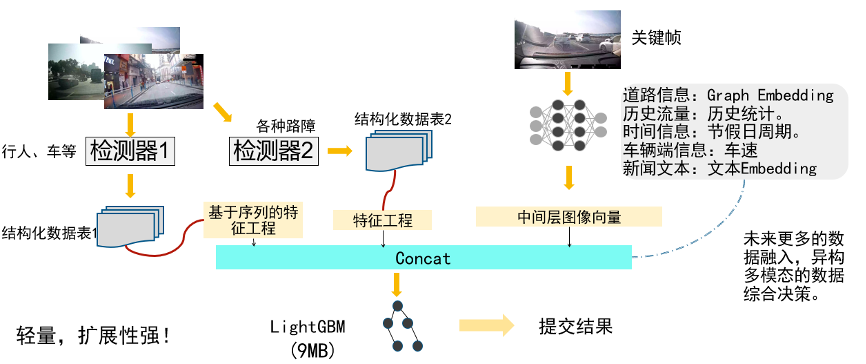
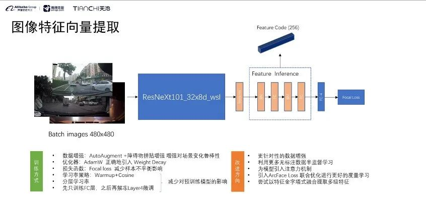

# A Personal Excercise for [AMAP-TECH](https://tianchi.aliyun.com/competition/entrance/531809/information)

## Datasets

You can find the datasets in [Tianchi](https://tianchi.aliyun.com/dataset/144857).

## Base Environment

* python=3.8
* cuda=12.0

## How to Run

* [amp_tech.ipynb](./amap_tech.ipynb) is the final version.
* [en_clf.ipynb](./en_clf.ipynb) is the classifier for the json.
* [obj_detect.ipynb](./obj_detect.ipynb) is to detect the object in the datasets with the YOLO V3.

## The Tutorial

You can represent the outcom through the below tutorial.

1. The whole Pipeline
   
2. Feature Extraction
   

## The Advantages

I have made the outcome of the baseline increase 10%.

## Author

It's Yongce Liu, here.
